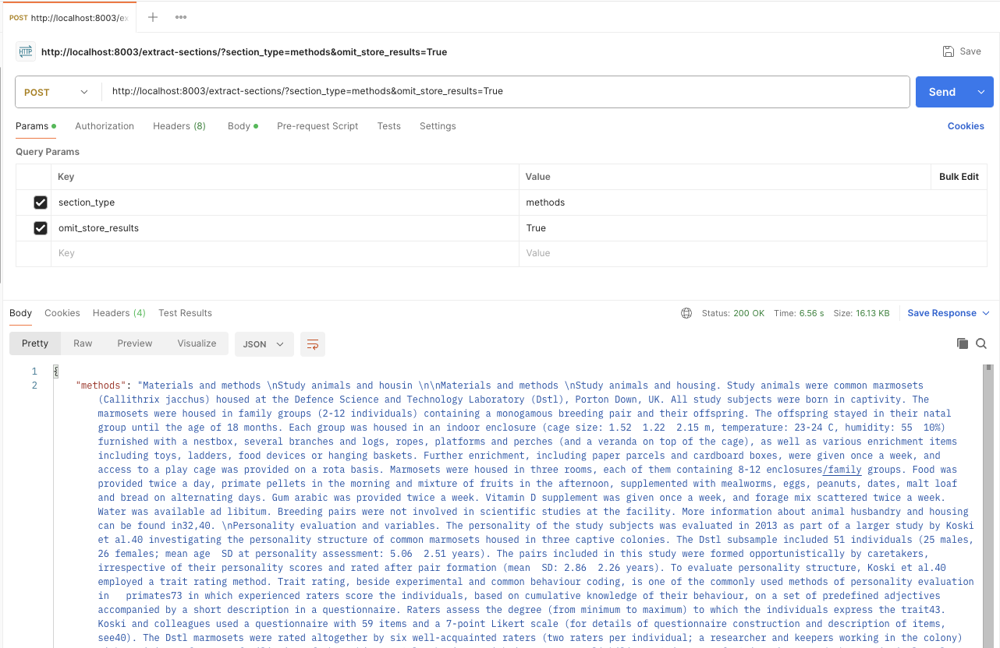
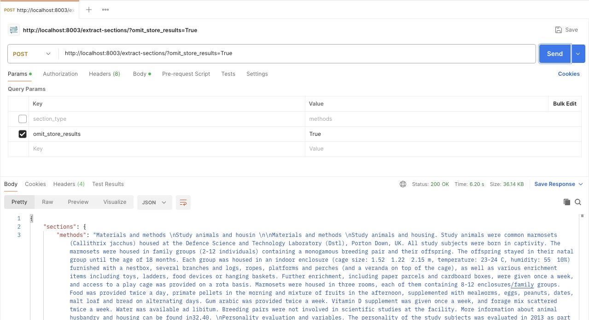

## Easy PDF Extractor

### 1. Project Overview

**Description**

Easy PDF Extractor is a service for robust PDF layout analysis and high‑quality text/section extraction, built on top of PyMuPDF and FastAPI. It exposes a simple HTTP API that accepts scientific or technical PDF documents, runs layout detection, generates visual artefacts with bounding boxes, and returns clean text or domain‑specific sections (e.g. methods, discussion, results, data availability).

**Core Objectives**

- **Reliable layout understanding**: Use PDF layout metadata and detection boxes to understand page structure (titles, text blocks, headers/footers, tables, images, etc.).
- **High‑quality text extraction**: Produce text that is de‑noised, de‑OCR‑artifacted, and suitable for downstream NLP/LLM pipelines.
- **Domain‑aware section extraction**: Extract key scientific sections like methods, results, discussion, and data availability via configurable term lists.
- **Simple integration surface**: Provide a small set of HTTP endpoints that can be integrated into data pipelines, microservices, and internal tools.

**Key Features and Capabilities**

- **Layout detection and visualisation**
  - Runs layout detection via `pymupdf4llm.to_markdown`, collecting `page_boxes` metadata.
  - Renders bounding boxes back onto PDFs, color‑coded by class (text, header, footer, table, picture, etc.).
  - Exports detections as a CSV (`*_detections.csv`) with page number, order, class id, and coordinates.
- **Text extraction**
  - Uses detections to extract text only from relevant regions (titles and text/list items).
  - Cleans and normalises text (fixes common OCR artefacts, URL reconstruction, Unicode handling, whitespace).
  - Writes extracted text into `*.txt` files for later use or inspection.
- **Section extraction**
  - Detects and extracts domain‑specific sections such as `methods`, `results`, `discussion`, and `das` (data availability) from the extracted text.
  - Removes references sections before extraction to reduce noise.
- **File‑scoped artefacts**
  - All outputs (processed PDFs, CSVs, text files) are written into per‑PDF subdirectories under a configurable base (default `test/`), and the API additionally stores uploads under `uploads/<pdf_stem>/`.
- **HTTP API**
  - `/process-pdf/`: Layout analysis and annotated PDF generation.
  - `/extract-text/`: Text extraction endpoint.
  - `/extract-sections/`: Section‑level extraction endpoint.

**Target Audience and Use Cases**

- **Data science and ML teams**
  - Pre‑process corpora of scientific papers for LLM training or RAG systems.
  - Build datasets keyed by precise sections (e.g. “methods” only).
- **Research infrastructure / knowledge management**
  - Automate ingestion of PDFs into knowledge bases with section-aware metadata.
  - Generate human‑readable text versions of PDFs for search and indexing.
- **Enterprise document processing**
  - Integrate into ETL pipelines where PDFs must be normalised before analysis.
  - Provide an internal “PDF to structured text/sections” microservice.

---

### 2. Architecture and Design

**High‑Level System Architecture**

- **API layer (`api.py`)**
  - FastAPI application exposing three main endpoints.
  - Handles upload, storage, basic validation, and error handling.
- **PDF processing core (`pdf_processor.py`)**
  - Layout detection, bounding‑box rendering, CSV export.
  - Text extraction and section extraction logic.
- **Text utility layer (`utils.py`)**
  - String normalisation, URL handling, and join/cleanup utilities.
- **Domain helper (`extractor_helper`, imported but not shown here)**
  - Provides functions and term lists for section extraction, including:
    - `extract_section`
    - `remove_references_section`
    - `METHODS_TERMS`, `DISCUSSION_TERMS`, `RESULTS_TERMS`, `DATA_AVAILABILITY`
- **Environment and runtime configuration**
  - Configuration via `.env` and environment variables for port and worker counts.

**Core Components and Responsibilities**

- **`FastAPI` application (`api.app`)**
  - Creates and configures the API (`title`, `description`, `version`).
  - Defines routes:
    - `POST /process-pdf/`: orchestrates layout detection via `PDFLayoutProcessor`.
    - `POST /extract-text/`: orchestrates text extraction via `PDFTextExtractor.extract_text`.
    - `POST /extract-sections/`: orchestrates section extraction via `PDFTextExtractor.extract_sections`.
  - Manages upload directories under `uploads/` and returns either files (`FileResponse`) or JSON (`JSONResponse`).
- **`PDFLayoutProcessor`**
  - Public method: `process_pdf(pdf_path, output_dir="test") -> (processed_pdf_path, detections_csv_path)`.
  - Internally:
    - Calls `get_page_boxes` to collect page‑level bounding box data via `pymupdf4llm.to_markdown`.
    - Calls `draw_bboxes_on_pdf` to produce annotated PDFs in `output_dir/<pdf_stem>/<pdf_stem>_processed.pdf`.
    - Calls `save_bboxes_csv` to write detection CSVs in the same directory.
- **`PDFTextExtractor`**
  - Responsible for turning raw PDFs plus detections into cleaned text and logically separated sections.
  - Core methods:
    - `extract_text() -> str`
      - Ensures a detections CSV exists (`_ensure_results_csv` → `PDFLayoutProcessor` when needed).
      - Filters detections to class IDs 0 and 1 (section headers/titles and body text).
      - Extracts page region text via `pymupdf`, then runs it through `utils.extract_links`, `utils.process_page_text`, and `utils.remove_unicode`.
      - Applies heuristics to join neighbouring text blocks, using spacing and case to decide line breaks.
      - Applies additional regex post‑processing to ensure that key section headings (Methods, Results, etc.) are well separated from following words.
      - Writes the final text into `<output_dir>/<pdf_stem>/<pdf_stem>.txt`.
    - `extract_sections(section_type: str | None)`
      - Ensures that the base text file exists (and regenerates if requested).
      - Removes the References section using `remove_references_section`.
      - Either:
        - Extracts all sections (when `section_type` is `None`, empty, or `"all"`), returning a dict of section name → text; or
        - Extracts a specific section using `extract_section` and the configured term lists.
- **Utility functions (`utils.py`)**
  - `clean_string`: fixes common OCR errors and domain‑specific typos.
  - `format_url_string_pattern`, `replace_text_with_links`, `extract_links`: robust URL reconstruction from broken PDF text/links.
  - `join_text`: consistent whitespace and line joining.
  - `process_page_text`: orchestrates cleaning, link substitution, and joining for a single page.
  - `remove_unicode`: normalises hyphens and strips non‑ASCII characters with controlled handling for spaces.

**Design Patterns Used**

- **Layered architecture**
  - Clear separation between HTTP layer (FastAPI), PDF processing core, and text utilities.
- **Facade / orchestration classes**
  - `PDFLayoutProcessor` and `PDFTextExtractor` act as facades around lower‑level procedural steps, providing simple entry points.
- **Configuration by environment**
  - FastAPI runtime configuration (port, workers) is driven via environment variables with sane defaults.
- **File‑per‑document partitioning**
  - Artefacts are grouped per PDF document in dedicated directories, simplifying cleanup and downstream processing.

**Data Flow and Module Interactions**

1. **Upload and storage**
   - Client `POST`s a `multipart/form-data` request with a PDF file.
   - `api.py` writes the file to `uploads/<pdf_stem>/<original_filename>.pdf`.
2. **Layout processing (`/process-pdf/`)**
   - `api.process_pdf` calls `PDFLayoutProcessor.process_pdf(file_path)`.
   - `get_page_boxes` uses `pymupdf4llm.to_markdown` to produce per‑page metadata including `page_boxes`.
   - `draw_bboxes_on_pdf` opens the original PDF with `pymupdf`, draws coloured rectangles and labels for each box, and saves the annotated PDF.
   - `save_bboxes_csv` writes CSV rows containing page number, order, class id, and coordinates.
   - The endpoint returns the annotated PDF.
3. **Text extraction (`/extract-text/`)**
   - `api.extract_text` instantiates `PDFTextExtractor` with `use_store_results` (controlled via `omit_store_results` flag).
   - `PDFTextExtractor.extract_text` ensures the CSV exists, reads relevant rows, and for each:
     - Clips the text from the PDF page with `pymupdf.Rect`.
     - Normalises and cleans via `utils` functions.
   - The endpoint returns the extracted text in a JSON document.
4. **Section extraction (`/extract-sections/`)**
   - `api.extract_sections` validates the `section_type` parameter.
   - Instantiates `PDFTextExtractor` and calls `extract_sections`.
   - Returns either a dict of all sections or a single section’s text in JSON.

---

### 3. Tech Stack

**Languages, Frameworks, and Libraries**

- **Language**
  - Python 3.13 (implied by `.venv` path; any recent Python 3.10+ should work with compatible dependencies).
- **Web framework**
  - FastAPI (`fastapi`, `starlette`) for asynchronous HTTP APIs.
  - Uvicorn for ASGI serving.
- **PDF & layout processing**
  - PyMuPDF (`pymupdf`) for direct PDF access and text extraction.
  - `pymupdf4llm` and `pymupdf-layout` for layout‑aware metadata generation and integration with LLM pipelines.
- **ML / runtime support**
  - `onnxruntime` (present in `requirements.txt`, reserved for potential ONNX‑based models or extended layout detection).
- **Utilities and dependencies**
  - `python-dotenv` / `dotenv` for environment loading.
  - `python-multipart` for file uploads in FastAPI.
  - `tabulate`, `numpy`, `sympy`, `networkx`, etc. available for extended processing if needed.

**Runtime and Infrastructure Requirements**

- **Runtime**
  - Python 3.10+ recommended (ensure compatibility with package versions in `requirements.txt`).
  - Access to the underlying filesystem for reading/writing:
    - `uploads/` for incoming files.
    - `test/` (or configured output directory) for artefacts.
- **Infrastructure**
  - Can run as a standalone service using Uvicorn/Gunicorn or under a process manager (e.g. systemd, Docker, Kubernetes).
  - For production: consider reverse proxy (e.g. Nginx, Traefik) with TLS termination in front of the FastAPI app.

**External Services or Dependencies**

- No external SaaS dependencies are required.
- The service is self‑contained; dependencies are Python packages from PyPI.

---

### 4. Installation and Setup

**Prerequisites**

- Python 3.10 or higher installed and available on `PATH`.
- `git` installed (if using git to fetch the repository).
- System packages required by PyMuPDF (these vary by OS; usually standard dev tools and `mupdf` dependencies; consult PyMuPDF documentation if installation fails).

**Step‑by‑Step Installation**

1. **Clone or obtain the source**

```bash
git clone <YOUR_REPO_URL> easy_pdf_extractor
cd easy_pdf_extractor
```

2. **Create and activate a virtual environment (recommended)**

```bash
python -m venv .venv
source .venv/bin/activate  # on macOS/Linux
# .venv\Scripts\activate   # on Windows (PowerShell/CMD)
```

3. **Install Python dependencies**

```bash
pip install --upgrade pip
pip install -r requirements.txt
```

**Environment Variable Configuration**

The application uses environment variables for runtime configuration. These can be defined in a `.env` file at the project root or in the process environment.

- **Supported variables**
  - `FAST_API_PORT` – Port for the FastAPI service (default: `8003` if unset).
  - `FAST_API_WORKERS` – Number of Uvicorn workers (default: `4` if unset).

**Example `.env` file**

```bash
FAST_API_PORT=8003
FAST_API_WORKERS=4
```

`api.py` calls `load_dotenv()` when started as a script, so values in `.env` are automatically applied.

**Local Development Setup**

1. Ensure the virtual environment is active and dependencies are installed.
2. Create `uploads/` directory if not present (it will be created automatically at runtime but can also be pre‑created).
3. (Optional) Create test PDFs under `test/` or `uploads/` for manual testing.
4. Start the API:

```bash
python api.py
```

The service will start on `http://0.0.0.0:<FAST_API_PORT>` (default `8003`).

---

### 5. Configuration

**Configuration Files and Their Purpose**

- **`requirements.txt`**
  - Declares all Python dependencies for reproducible environments.
- **`.env`**
  - Stores environment‑specific configuration: listen port, worker count, and any additional settings you wish to add.
- **Directories**
  - `uploads/` – Input PDFs uploaded via API requests, organised per PDF.
  - `test/` – Default output directory for processed PDFs, CSVs, and text files.

**Environment‑Specific Configuration**

- **Development**
  - Low number of workers (e.g. `FAST_API_WORKERS=1` or `2`) for easier debugging.
  - Verbose logging (the default `INFO` is usually sufficient; adjust with `logging.basicConfig` if needed).
  - Port typically `8000` or `8003`.
- **Staging/Production**
  - Configure `FAST_API_PORT` to a non‑conflicting port inside the container/VM.
  - Increase `FAST_API_WORKERS` based on CPU core count and load characteristics.
  - Optionally, set log level via environment variables or code changes for reduced noise.

**Secrets Management Considerations**

- The current codebase does **not** require external secrets (no database, no third‑party APIs).
- For production environments:
  - Avoid committing `.env` to version control.
  - Use infrastructure secrets management (e.g. AWS SSM, HashiCorp Vault, Kubernetes Secrets) to inject environment variables when additional sensitive config is added in the future.

---

### 6. Usage

**How to Run the Application**

From the repository root with the virtual environment activated:

```bash
python api.py
```

This will:

- Load environment variables from `.env`.
- Start Uvicorn with the configured number of workers on `0.0.0.0:<FAST_API_PORT>`.

Alternatively, you can run with `uvicorn` directly:

```bash
uvicorn api:app --host 0.0.0.0 --port 8003 --workers 4
```

**Example Commands (cURL)**

Replace `YOUR_FILE.pdf` with the path to a local PDF.

- **Process PDF and get annotated PDF**

```bash
curl -X POST "http://localhost:8003/process-pdf/" \
  -H "accept: application/pdf" \
  -H "Content-Type: multipart/form-data" \
  -F "file=@YOUR_FILE.pdf" \
  --output processed.pdf
```

- **Extract full text from PDF**

```bash
curl -X POST "http://localhost:8003/extract-text/" \
  -H "accept: application/json" \
  -H "Content-Type: multipart/form-data" \
  -F "file=@YOUR_FILE.pdf"
```

Optional query parameter:

- `omit_store_results` (bool; default `false`):
  - When `true`, forces regeneration of CSV/TXT artefacts even if they already exist.

- **Extract specific section(s) from PDF**

```bash
curl -X POST "http://localhost:8003/extract-sections/?section_type=methods&omit_store_results=true" \
  -H "accept: application/json" \
  -H "Content-Type: multipart/form-data" \
  -F "file=@YOUR_FILE.pdf"
```

Valid `section_type` values:

- `"methods"`
- `"discussion"`
- `"results"`
- `"das"` (data availability section)
- `"all"` or omitted/empty (returns all supported sections)

You can also pass `omit_store_results=true` as for `/extract-text/`.

**Using Postman (Screenshots)**

The following screenshots show example requests in Postman:

- **Extracting a single section with `omit_store_results` enabled**  
  

- **Extracting all supported sections in a single request**  
  

**Sample API Responses**

- **`/extract-text/` (success)**

```json
{
  "text": "Title of the paper\n\nMethods\nWe conducted a multi-centre study...\n\nResults\nThe primary endpoint..."
}
```

- **`/extract-text/` (no text found)**

```json
{
  "message": "No text found in the PDF"
}
```

- **`/extract-sections/` for `section_type=methods`**

```json
{
  "methods": "We conducted a multi-centre study involving..."
}
```

- **`/extract-sections/` for `section_type=all`**

```json
{
  "sections": {
    "methods": "Methods section text...",
    "discussion": "Discussion section text...",
    "results": "Results section text...",
    "das": "Data availability section text..."
  }
}
```

**Output Artefact Layout**

- **Uploads**
  - `uploads/<pdf_stem>/<original_filename>.pdf`
- **Processing outputs** (default `output_dir="test"`):
  - `test/<pdf_stem>/<pdf_stem>_processed.pdf` – annotated PDF with bounding boxes.
  - `test/<pdf_stem>/<pdf_stem>_detections.csv` – CSV of detections.
  - `test/<pdf_stem>/<pdf_stem>.txt` – cleaned, extracted text.

---

### 7. Testing

**Testing Strategy**

- The repo currently includes test artefacts under `test/` (example PDFs, text, and detection CSVs) intended for manual validation and regression checks.
- The core logic is structured so `pdf_processor.py` and `utils.py` can be unit‑tested without running the HTTP API.
- Recommended testing levels:
  - **Unit tests** for:
    - `utils` (string cleaning, URL reconstruction, unicode handling).
    - `PDFTextExtractor` and `PDFLayoutProcessor` behaviour on small PDFs with known layouts.
  - **Integration tests** for:
    - End‑to‑end PDF upload → API → output using FastAPI’s `TestClient`.

**How to Run Tests**

- If/when you add tests using `pytest`, a typical setup would be:

```bash
pip install pytest
pytest
```

At present, there is no dedicated automated test suite in the repository; contributors are encouraged to add tests for new behaviour.

**Test Structure and Conventions (Recommended)**

- Place test files under a `tests/` directory:
  - `tests/test_utils.py` for `utils.py`.
  - `tests/test_pdf_processor.py` for `pdf_processor.py`.
  - `tests/test_api.py` for endpoint‑level tests with FastAPI’s `TestClient`.
- Use fixtures for:
  - Temporary directories to avoid polluting the real `test/` and `uploads/` directories.
  - Sample PDFs with small size but representative structures.

**Code Coverage Expectations**

- Aim for:
  - **80%+** line coverage for `utils.py`.
  - **70%+** line coverage for `pdf_processor.py` (layout, extraction, sectioning).
  - Core API paths (`/process-pdf/`, `/extract-text/`, `/extract-sections/`) covered by at least one integration test each.

---

### 8. Deployment

**Build Process**

- The application is pure Python and does not require a compile step; deployment usually involves:
  - Creating a virtual environment (or container image).
  - Installing `requirements.txt`.
  - Providing a `.env` (or environment variables) for runtime configuration.

**Example Dockerfile (Suggested)**

```dockerfile
FROM python:3.11-slim

WORKDIR /app

COPY requirements.txt .
RUN pip install --no-cache-dir -r requirements.txt

COPY . .

ENV FAST_API_PORT=8003 FAST_API_WORKERS=4

CMD ["uvicorn", "api:app", "--host", "0.0.0.0", "--port", "8003", "--workers", "4"]
```

**CI/CD Pipeline Overview (Recommended)**

- **CI pipeline**
  - Install dependencies.
  - Run `pytest` and static analysis (e.g. `ruff`, `mypy`) if configured.
  - Build and push Docker image to a registry.
- **CD pipeline**
  - Deploy new image to the target environment (e.g. Kubernetes, ECS, VM).
  - Run smoke tests against the `/extract-text/` endpoint on sample PDFs.

**Deployment Environments**

- **Development**
  - Local machine, using `python api.py` or `uvicorn`.
- **Staging**
  - Mirrors production with smaller resource allocation and a limited set of test PDFs.
  - Used to validate new functionality and performance before promotion.
- **Production**
  - Runs behind a reverse proxy, scaled horizontally as needed.
  - Monitored via standard HTTP metrics (latency, error rate) and system metrics (CPU, memory, disk I/O).

**Rollback Strategy**

- Use versioned Docker images or tagged releases.
- Keep at least one previous known‑good release available.
- Rollback procedure:
  - Redeploy the last stable image via your orchestration platform.
  - Confirm health checks and smoke tests pass.

---

### 9. Performance and Scalability

**Performance Considerations**

- PDF processing is CPU‑bound and, for large PDFs, can be memory intensive.
- Layout detection via `pymupdf4llm.to_markdown` and per‑region text extraction both scale roughly linearly with page count.
- Non‑ASCII and OCR artefact cleaning adds minor overhead but significantly improves text quality.

**Bottlenecks and Mitigation Strategies**

- **Large PDFs**
  - Increase worker count (`FAST_API_WORKERS`) for better concurrency when many small documents are processed.
  - Consider splitting very large PDFs into smaller chunks in upstream pipelines.
- **Disk I/O**
  - Outputs are written to disk; on high‑throughput systems, ensure:
    - Fast local or networked storage.
    - Periodic cleanup of older artefacts.
- **CPU usage**
  - Use container resource limits and HPA (Horizontal Pod Autoscaler) or equivalent orchestration features to autoscale.

**Scaling Approach**

- **Vertical scaling**
  - Increase CPU and memory per instance for heavy processing workloads.
- **Horizontal scaling**
  - Run multiple instances of the service behind a load balancer.
  - Configure Uvicorn workers per instance to utilise available CPU cores.
- **Workload shaping**
  - Introduce request rate‑limiting or a job queue (e.g. Celery/RQ) for very heavy or asynchronous workloads if the synchronous request/response model becomes a bottleneck.

---

### 10. Security

**Authentication and Authorization**

- The current implementation does **not** include authentication/authorization.
- For production deployments, recommended options:
  - API gateway or reverse proxy with:
    - API key validation.
    - OAuth2 / OIDC integration.
  - Network‑level access controls (VPC/private network, VPN).

**Data Protection Practices**

- Uploaded PDFs and generated artefacts are stored on disk under `uploads/` and `test/`.
- Recommended production practices:
  - Store artefacts on encrypted disks or encrypted volumes.
  - Enforce retention policies and periodic cleanup (e.g. delete artefacts older than N days).
  - Avoid storing highly sensitive PDFs long term unless strictly required.

**Common Vulnerabilities and Handling**

- **Untrusted file uploads**
  - Only PDFs should be accepted; consider adding explicit content‑type and basic file validation.
  - Run the service under a non‑privileged user with limited filesystem permissions.
  - Consider sandboxing PDF processing if running untrusted content at scale.
- **Denial of Service (DoS) via large PDFs**
  - Enforce maximum upload size at the reverse proxy and/or FastAPI level.
  - Consider timeouts and cancellation for extremely long‑running operations.
- **Information leakage**
  - Ensure logs do not store full text of PDFs in production environments; redact if necessary.

---

### 11. Contributing

**Branching Strategy (Suggested)**

- **`main`** (or `master`)
  - Always deployable; contains the latest stable release.
- **Feature branches**
  - Create branches from `main` for new features or fixes, e.g. `feature/section-tuning`, `fix/text-cleaning-bug`.
  - Rebase or merge `main` regularly to reduce drift.

**Commit Message Conventions**

- Use concise, descriptive commit messages:
  - **Format**: `type(scope): short description`
  - **Examples**:
    - `feat(api): add omit_store_results flag`
    - `fix(text): correct unicode stripping logic`
    - `refactor(pdf): extract PDFTextExtractor helper`
    - `docs: expand usage examples`

**Pull Request Process**

- Create a PR from your feature branch into `main`.
- Include:
  - Clear description of the change and rationale.
  - Before/after behaviour where relevant (e.g. sample extracted text).
  - Notes on any performance or compatibility implications.
- Ensure:
  - Tests pass (`pytest`), if present.
  - New code paths are covered by at least one unit or integration test.

**Code Review Expectations**

- Reviewers should check for:
  - Correctness of PDF/text processing logic (edge cases, multi‑page behaviour, section boundaries).
  - Readability and maintainability (clear naming, modular functions).
  - Performance implications on large PDFs.
  - Security considerations around file uploads and storage.
- Authors are expected to:
  - Respond constructively to review comments.
  - Update documentation (`README.md` and/or inline docstrings) when behaviour changes.

---

For any questions, proposed changes, or bug reports, please open an issue or start a discussion in the repository so that maintainers and contributors can collaborate effectively.

